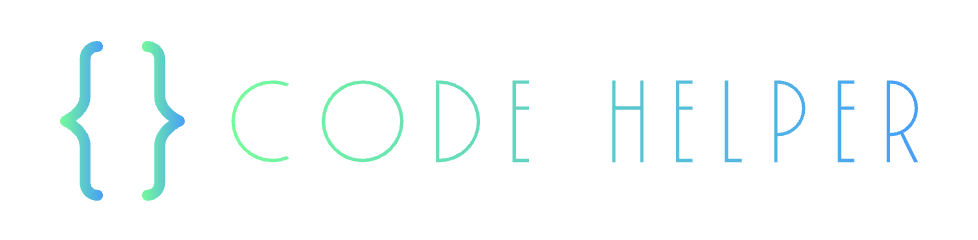

# 
## Introduction
**CODE HELPER** is a state-of-the-art platform tailored for developers to collaborate seamlessly on projects. The platform empowers developers to offer, accept, and manage projects based on expertise and financial considerations, be it collaborative, paid, or open-source.

---

## Table of Contents
- [Project Overview](#project-overview)
- [Objectives](#objectives)
- [Technologies Used](#technologies-used)
- [Get Started](#get-started)
- [Development Process](#development-process)
- [Code Breakdown](#code-breakdown)
- [License](#license)
- [Live Link](#live-link)
- [Collaborators](#collaborators)
## Project Overview
Developed adhering to the MVC principles, our mission is to foster a community where developers can find projects that align with their expertise and passion, ensuring efficient and quality project delivery.
## Objectives
- Facilitate a platform for developers to **offer and accept** projects.
- Foster a community of collaborative, paid, and open-source enthusiasts.
- Provide a user-friendly interface for hassle-free collaboration.
## Technologies Used
- **Node.js**
- **Express**
- **Express-Session**
- **Handlebars**
- **MySQL**
- **Sequelize**
- **Tailwind CSS**
- **Keen Slider**
## Get Started
1. Ensure `Node.js`, `MySQL`, and `Sequelize CLI` are set up on your machine.
2. Clone the GitHub repository: `git clone repository-link`.
3. Navigate to the project directory: `cd code-helper`.
4. Install dependencies: `npm install`.
5. Configure the `.env` file with your database credentials.
6. Initialize the database: `npm run db:init`.
7. Seed the database: `npm run seed`.
8. Launch the server: `npm start`.
## Development Process
### Project Initialization
Kickstart the project with meticulous planning, resource allocation, and code repository initialization.
### Database Configuration
Harness the power of MySQL with Sequelize to design a robust database schema capable of handling diverse project offerings and acceptances.
### MVC Development
Adhere to MVC principles, ensuring the project structure is organized, scalable, and maintainable.
### UI/UX Implementation
Integrate Tailwind CSS & Keen Slider for a seamless user experience, ensuring responsive and intuitive navigation.
### Quality Control & Deployment
Implement rigorous testing, quality assurance, and finally, deploy the application on **Heroku** for global accessibility.
## Code Breakdown
### Routes
- **App Routes**: Manage the posts, offerings, and user expertise and can leave comments.
- **User Routes**: Handle user registration, authentication, and profile management.
### Database Layer: Sequelize & MySQL
- Efficient data modeling and relations.
- Secure and swift data transactions and seeding.
## License
This project is open to contributions and is licensed under the MIT License. Feel free to fork, modify, and open pull requests. We appreciate every contributor’s efforts to make **Code Helper** even better!
## Features
If your project has a lot of features, list them here.
## How to Contribute
Fork the repository and contribute.
## Live Link
### Useful Links
- [Live Application on Heroku](https://morning-lake-13776-b0a983f7a31f.herokuapp.com/)
- [Demo Video](#)
- [License & Contribution](#license)
## Collaborators
- Sep Alamouti
- Justin Surette
- Riley Gaffney
- Hui Pan
- Carlovsky Bellefleur
